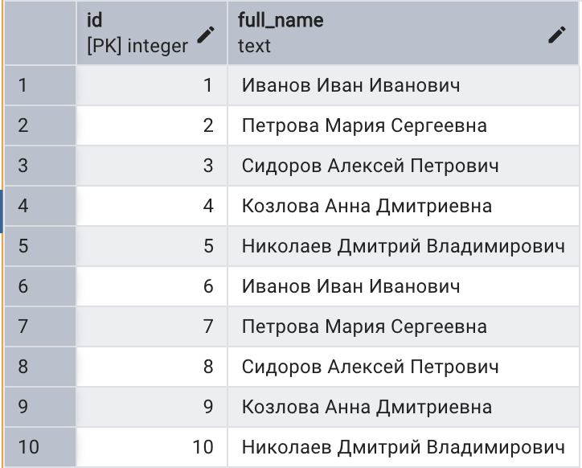
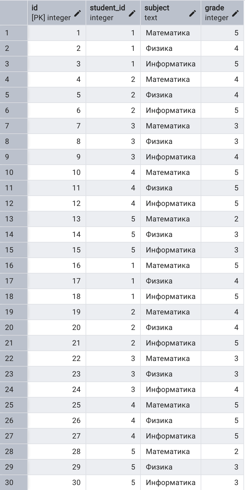
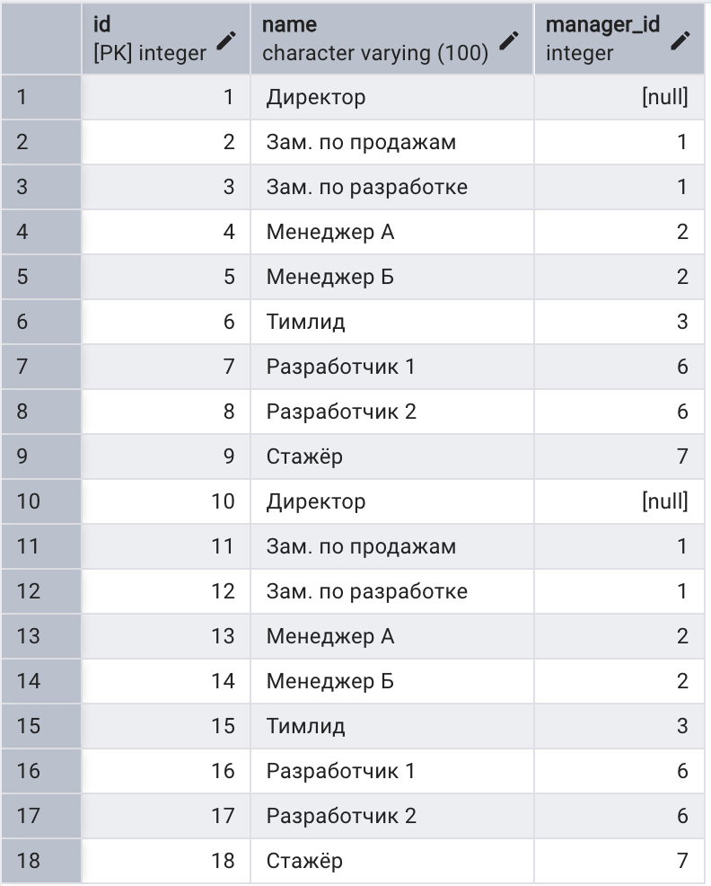
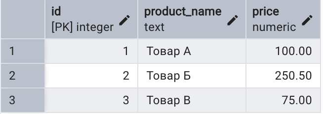

# BD Pg4amb — задания (PostgreSQL)

---

# Задание 1. Табличная функция: студенты со средним баллом выше заданного

## Что делает код

1. Создаёт таблицы **students** и **grades** (если их ещё нет).
2. Заполняет их примерами данных (студенты и оценки по предметам).
3. Создаёт табличную функцию **get_students_above_avg(...)**.

---

## Таблицы

- **students** — студенты: `id`, `full_name`.
- **grades** — оценки: `id`, `student_id` (ссылка на students), `subject`, `grade`.

### Скриншоты таблиц

**Таблица students**



**Таблица grades**



---

## Функция get_students_above_avg(min_avg_grade)

- **Вход:** один аргумент — минимальный средний балл (тип `NUMERIC`).
- Для каждого студента считается средний балл по всем его оценкам из **grades**.
- Остаются только те, у кого средний балл **строго больше** заданного порога.
- **Выход:** таблица с колонками: `student_id`, `full_name`, `avg_grade`.

### Как работает внутри

- `JOIN` связывает студентов с их оценками.
- `GROUP BY s.id, s.full_name` — группировка по студенту.
- `AVG(g.grade)` — средний балл по предметам.
- `HAVING AVG(g.grade) > min_avg_grade` — фильтр «выше заданного».
- `ROUND(..., 2)` — средний округляется до двух знаков после запятой.

---

## Пример вызова

```sql
SELECT * FROM get_students_above_avg(4.0);
```

Вернёт всех студентов, у которых средний балл больше 4.0.

---

## Запуск

Выполните скрипт в PostgreSQL (pgAdmin или psql):

```bash
psql -U your_user -d your_database -f task1_students_above_avg.sql
```

Файл задания: **task1_students_above_avg.sql**

---

# Задание 2. Рекурсивная функция: иерархия подчинённых

## Что делает скрипт

1. Создаёт таблицу **employees** (если её ещё нет).
2. Заполняет её примерами данных (сотрудники и руководители).
3. Создаёт функцию **get_subordinates_hierarchy(...)**.

## Таблица

- **employees** — сотрудники: `id`, `name`, `manager_id` (ссылка на руководителя).

### Скриншот таблицы

**Таблица employees**



## Функция get_subordinates_hierarchy(start_employee_id)

- **Вход:** один аргумент — id сотрудника (тип `INTEGER`).
- Возвращает **всех подчинённых** этого сотрудника (прямых и косвенных), включая его самого.
- **Выход:** таблица с колонками: `employee_id`, `employee_name`, `level` (уровень в иерархии; 0 — сам сотрудник).

### Как работает внутри

- Используется **рекурсивный CTE** (`WITH RECURSIVE`).
- **Якорь:** сам сотрудник с переданным id (level = 0).
- **Шаг рекурсии:** сотрудники, у которых `manager_id` совпадает с кем-то из уже найденных.
- Результат сортируется по уровню иерархии (и по `employee_id`).

## Пример вызова

```sql
SELECT * FROM get_subordinates_hierarchy(1);
```

Вернёт сотрудника с id = 1 (level 0) и всех его подчинённых по иерархии (level 1, 2, …).

## Запуск

```bash
psql -U your_user -d your_database -f task2_subordinates_hierarchy.sql
```

Файл задания: **task2_subordinates_hierarchy.sql**

---

# Задание 3. Функция: увеличение цен на 10% и возврат количества записей

## Что делает скрипт

1. Создаёт таблицу **products** (если её ещё нет).
2. Заполняет её примерами данных.
3. Создаёт функцию **increase_prices_10_percent()**.

## Таблица

- **products** — товары: `id`, `product_name`, `price`.

### Скриншот таблицы

**Таблица products**



## Функция increase_prices_10_percent()

- Перебирает **все записи** таблицы products.
- Увеличивает цену каждого товара **на 10%**.
- **Обновляет** таблицу.
- **Возвращает** количество обработанных записей (тип `INTEGER`).

### Как работает внутри

- Один `UPDATE` по всей таблице: `SET price = price * 1.10`.
- Количество обновлённых строк берётся через `GET DIAGNOSTICS ... ROW_COUNT`.
- Функция написана на **plpgsql** (нужна для переменной и возврата числа).

## Пример вызова

```sql
SELECT increase_prices_10_percent();
```

Вернёт число обработанных (обновлённых) записей.

## Запуск

```bash
psql -U your_user -d your_database -f task3_increase_prices.sql
```

Файл задания: **task3_increase_prices.sql**
